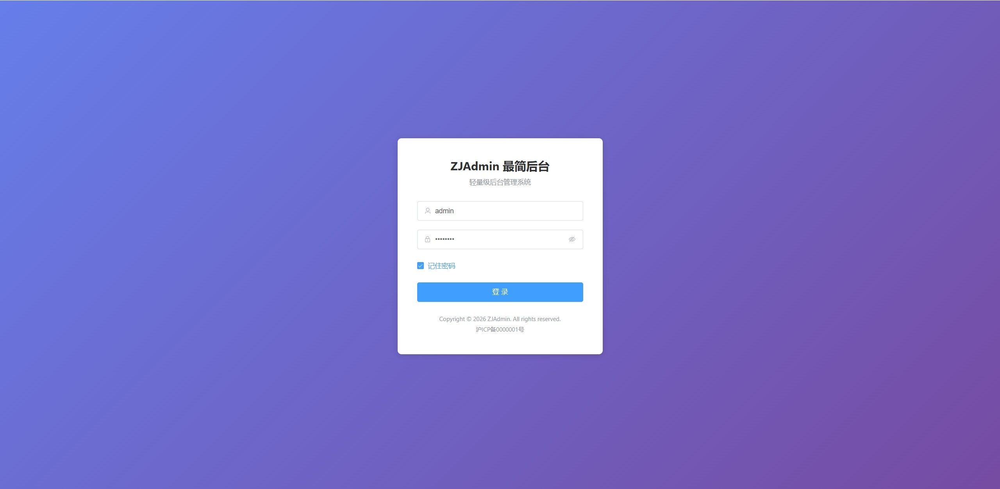
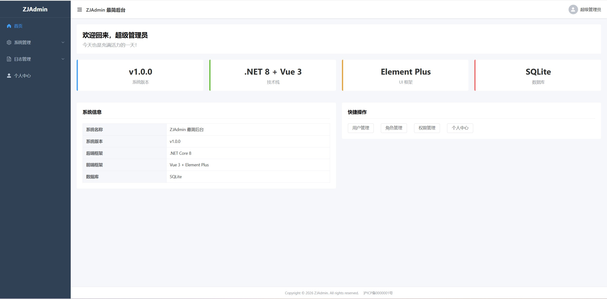
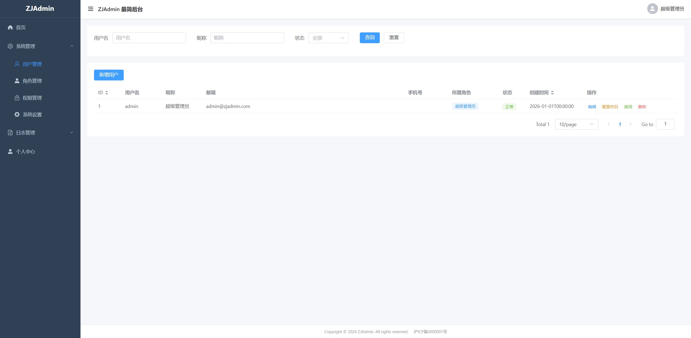
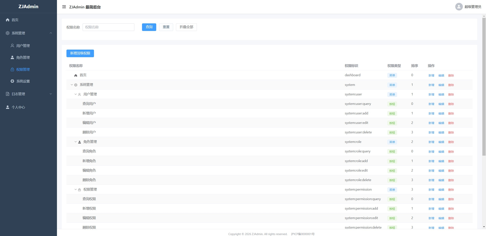
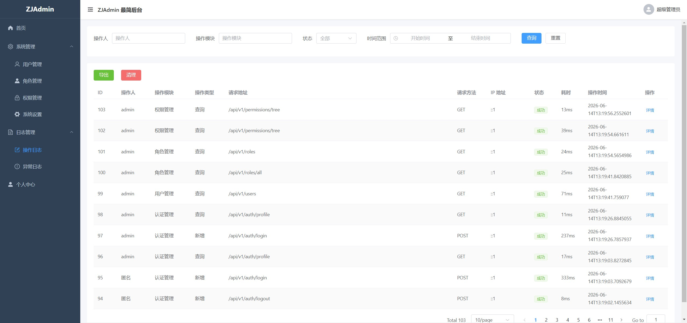

# ZJAdmin

A lightweight, RBAC-based admin panel built with **ASP.NET Core 8** + **Vue 3** + **Element Plus**.

## Screenshots

| Login | Dashboard |
:---:|:---:
|  |  |

| User Management | Role Management | Permission Management |
:---:|:---:|:---:
|  |  |  |

## Features

- **RBAC** — Role-based access control with fine-grained button-level permissions
- **Multi‑database** — SQLite out of the box, switch to MySQL by changing one config entry
- **JWT Auth** — Token-based authentication with login lockout protection
- **Operation Log** — Automatic audit trail for every API request
- **Exception Log** — Server error & failed login persistence
- **Menu Management** — Dynamic menus and buttons driven by permission data
- **System Config** — Key-value site settings (title, keywords, ICP, copyright)

## Tech Stack

| Layer | Technology |
|-------|-----------|
| Backend | ASP.NET Core 8 Web API |
| ORM | Entity Framework Core 8 |
| Frontend | Vue 3 (Composition API) + Vite |
| UI | Element Plus |
| Auth | JWT Bearer + BCrypt |
| Logging | Serilog |
| Database | SQLite / MySQL |

## Quick Start

### Prerequisites

- [.NET 8 SDK](https://dotnet.microsoft.com/download/dotnet/8.0)
- [Node.js 18+](https://nodejs.org/)

### Backend

```bash
cd backend/ZJAdmin.Api
dotnet run --urls "http://localhost:5000"
```

The database and seed data are auto-created on first run.

### Frontend

```bash
cd frontend
npm install
npm run dev
```

The dev server starts at `http://localhost:3417` and proxies `/api` to the backend.

### Default Login

| Username | Password | Role |
|----------|----------|------|
| `admin` | `admin123` | Super Admin (full access) |

## Database

**SQLite** is used by default — no extra setup needed.

To switch to **MySQL**, edit `backend/ZJAdmin.Api/appsettings.json`:

```json
{
  "DatabaseProvider": "Mysql",
  "ConnectionStrings": {
    "MySqlConnection": "Server=your_host;Port=3306;Database=zjadmin;User=your_user;Password=your_pass;Charset=utf8mb4"
  }
}
```

The schema is auto-created on first run.

## Docker

```bash
docker compose up -d
```

The app is served on port `8080` with Nginx. Override the DB provider via env:

```bash
DATABASE_PROVIDER=MySql MYSQL_CONNECTION_STRING="..." docker compose up -d
```

## API

All endpoints follow a unified response format:

```json
{
  "code": 200,
  "message": "success",
  "data": {},
  "total": 100
}
```

| Module | Path | Description |
|--------|------|-------------|
| Auth | `/api/v1/auth/*` | Login, logout, profile, change password |
| Users | `/api/v1/users/*` | User CRUD, reset password, enable/disable |
| Roles | `/api/v1/roles/*` | Role CRUD, assign permissions |
| Permissions | `/api/v1/permissions/*` | Permission CRUD, permission tree |
| Operation Logs | `/api/v1/operation-logs/*` | Query, detail, export, cleanup |
| Exception Logs | `/api/v1/exception-logs/*` | Query, detail, export, cleanup |

## Project Structure

```
├── backend/
│   └── ZJAdmin.Api/
│       ├── Controllers/    # API endpoints
│       ├── Services/       # Business logic
│       ├── Models/         # Entity models
│       ├── DTOs/           # Data transfer objects
│       ├── Data/           # DbContext & seed data
│       ├── Middleware/     # Exception, operation log, permission auth
│       ├── Attributes/     # Custom attributes
│       └── Program.cs      # Startup configuration
├── frontend/
│   └── src/
│       ├── api/            # Axios API layer
│       ├── layouts/        # Layout components
│       ├── views/          # Page components
│       ├── stores/         # Pinia state (auth, app)
│       ├── router/         # Vue Router
│       └── utils/          # Utility functions
├── images/                 # Screenshots
├── docker-compose.yml
└── Dockerfile
```

## License

MIT
